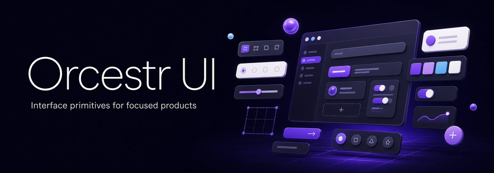

<p align="right">
  <strong>English</strong> · <a href="./README.ru.md">Русский</a>
</p>

<p align="center">
  <a href="https://orcestr.com">
    
  </a>
</p>

# Orcestr UI

[](https://www.npmjs.com/package/@orcestr/ui)
[](./LICENSE)

## [Live Demo](https://orcestr.com/ui)

Accessible React components and styles for application interfaces.

Includes layout primitives, controls, fields, overlays, data views, workflow states, theme tokens and utility hooks.

Main website: [orcestr.com](https://orcestr.com)

## Status

| Item    | Value                                     |
| ------- | ----------------------------------------- |
| Package | `@orcestr/ui`                             |
| Version | `0.3.0`                                   |
| Status  | Beta                                      |
| Runtime | React 19                                  |
| Styling | bundled CSS from `@orcestr/ui/styles.css` |

The public API is still being shaped while the package is in beta.

## What Is Inside

| Area       | Includes                                                                       |
| ---------- | ------------------------------------------------------------------------------ |
| App layout | shell, navigation patterns, page surfaces                                      |
| Actions    | buttons, icon buttons, menus, command surfaces                                 |
| Inputs     | fields, selects, comboboxes, pickers, switches, checkboxes, segmented controls |
| Overlays   | dialogs, drawers, modals, popovers, tooltips, context menus, confirm flows     |
| Data views | tables, pagination, empty/error/loading states, badges, alerts                 |
| Workflows  | lifecycle and status components for operational screens                        |
| Foundation | provider, locale, theme tokens, CSS variables, utility hooks                   |

## Install

```bash
npm install @orcestr/ui
```

For local Orcestr development:

```bash
npm install ../../orcestr-ui
```

## Usage

Import the CSS once near the app root and wrap the app with `OrcestrUiProvider`.

```tsx
import { Button, OrcestrUiProvider } from '@orcestr/ui';
import '@orcestr/ui/styles.css';

export function App() {
    return (
        <OrcestrUiProvider locale="en" defaultMode="dark">
            <Button>Save</Button>
        </OrcestrUiProvider>
    );
}
```

React Query integration is optional:

```ts
import { usePaginatedComboboxQueryLoader } from '@orcestr/ui/react-query';
```

Server Components can import render-only primitives without crossing a client boundary:

```tsx
import { Box, Flex, Table, Text } from '@orcestr/ui/server';
```

The demo page is exported separately:

```tsx
import { UiExamplePage } from '@orcestr/ui/example/UiExamplePage';
import '@orcestr/ui/example/styles.css';
```

## Entrypoints

| Entrypoint                          | Purpose                                    |
| ----------------------------------- | ------------------------------------------ |
| `@orcestr/ui`                       | Components, providers, hooks and theme API |
| `@orcestr/ui/server`                | Server-safe render-only primitives         |
| `@orcestr/ui/styles.css`            | Runtime styles for the UI kit              |
| `@orcestr/ui/react-query`           | Optional React Query adapter               |
| `@orcestr/ui/example/UiExamplePage` | Demo page component                        |
| `@orcestr/ui/example/styles.css`    | Demo page styles                           |

## Scripts

```bash
npm run build
npm run typecheck
npm test
npm run check:package
npm run pack:dry-run
```

| Script                  | What it checks                                       |
| ----------------------- | ---------------------------------------------------- |
| `npm run build`         | TypeScript output, declarations, CSS and ESM imports |
| `npm run typecheck`     | TypeScript without emit                              |
| `npm test`              | Contract and state tests                             |
| `npm run check:package` | Public Node ESM entrypoints                          |
| `npm run pack:dry-run`  | Published package contents                           |

## Release

NPM publishing runs through GitHub Actions on tags matching `ui-v*`.

Local helpers:

```bash
npm run release:patch
npm run release:minor
npm run release:major
```

Each helper updates `package.json` and `package-lock.json`, creates a release commit and creates a tag such as `ui-v0.3.1`.

```bash
git push
git push origin ui-v0.3.1
```

The workflow runs typecheck, tests, build and `npm pack --dry-run` before publishing.

Full release guide: [docs/RELEASE.md](./docs/RELEASE.md).

## Maintainer

Public updates are maintained by [@Artasov](https://github.com/Artasov).

## License

Licensed under the [Mozilla Public License 2.0](./LICENSE). Commercial use is permitted; changes
to MPL-covered files remain subject to the MPL. See [NOTICE](./NOTICE) for attribution and
[TRADEMARKS.md](./TRADEMARKS.md) for brand-use rules.
