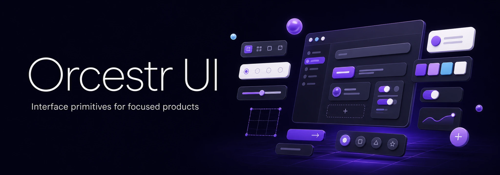

<p align="right">
  <a href="./README.md">English</a> · <strong>Русский</strong>
</p>

<p align="center">
  <a href="https://orcestr.com">
    
  </a>
</p>

# Orcestr UI

## [Demo](https://orcestr.com/ui)

Открой live example page, чтобы посмотреть компоненты и паттерны Orcestr UI в контексте.

Общая React UI-основа для продуктов Orcestr.

Orcestr UI - публичная библиотека компонентов, выделенная из реальной продуктовой разработки Orcestr. Здесь собираются интерфейсные примитивы, которые переиспользуются в product surfaces: application shell, плотные операционные контролы, workflow-состояния, overlays, поля, data views, design tokens и инфраструктура темы.

Цель - практическое переиспользование, а не витринная дизайн-система. Компоненты делаются для продуктовых экранов, где пользователь сканирует данные, принимает решения, подтверждает действия, проходит workflows и каждый день возвращается к одним и тем же инструментам.

Часть экосистемы [Orcestr](https://orcestr.com).

## Статус

Статус: ранний публичный UI-слой.

Пакет уже используется как общая UI-основа для разработки Orcestr. Public API достаточно компактный, чтобы оставаться понятным, но уже покрывает реальные application screens: buttons, fields, pickers, overlays, tables, command surfaces, app shell, workflow components, theme и locale providers.

## Установка

```bash
npm install @orcestr/ui
```

Для локальной разработки из продуктового репозитория Orcestr:

```bash
npm install ../../orcestr-ui
```

## Использование

Подключи runtime styles один раз рядом с корнем приложения и оберни приложение в `OrcestrUiProvider`.

```tsx
import {Button, OrcestrUiProvider} from '@orcestr/ui';
import '@orcestr/ui/styles.css';

export function App() {
    return (
        <OrcestrUiProvider locale='ru' defaultMode='dark'>
            <Button>Сохранить</Button>
        </OrcestrUiProvider>
    );
}
```

React Query adapter опциональный и вынесен из основного entrypoint:

```ts
import {usePaginatedComboboxQueryLoader} from '@orcestr/ui/react-query';
```

Example page опубликована отдельным entrypoint, со своими demo styles:

```tsx
import {UiExamplePage} from '@orcestr/ui/example/UiExamplePage';
import '@orcestr/ui/example/styles.css';
```

## Что внутри

- Application shell primitives для продуктовых layouts.
- Theme, tokens, system props и locale provider.
- Actions, buttons, icon buttons, menus и command surfaces.
- Fields, selects, comboboxes, pickers, switches, checkboxes и segmented controls.
- Dialogs, drawers, modals, popovers, tooltips, context menus и confirm flows.
- Tables, pagination, state views, badges, alerts, skeletons и spinners.
- Workflow components для lifecycle, status и операционных process screens.
- Utility hooks для disclosure, floating layers, focus, keyboard navigation и controlled state.

## Дизайн-направление

Orcestr UI рассчитан на операционный софт: dashboards, catalogs, workflows, review screens, finance tools, procurement flows и internal product surfaces.

Дизайн-направление спокойное и функциональное:

- плотная, но читаемая информация;
- предсказуемые контролы;
- понятные состояния и подтверждения;
- переиспользуемые theme tokens;
- компоненты, которые проходят реальное продуктовое использование до закрепления в public API.

## Package Entrypoints

| Entrypoint | Назначение |
| --- | --- |
| `@orcestr/ui` | Основные React components, providers, hooks и theme API. |
| `@orcestr/ui/styles.css` | Runtime styles библиотеки компонентов. |
| `@orcestr/ui/react-query` | Optional React Query adapter для paginated combobox loaders. |
| `@orcestr/ui/example/UiExamplePage` | Demo page для визуальной проверки и внутренней документации. |
| `@orcestr/ui/example/styles.css` | Styles только для example page. |

## Скрипты

```bash
npm run build
npm run typecheck
npm test
npm run pack:dry-run
```

- `npm run build` собирает `dist` JavaScript, declarations и CSS.
- `npm run typecheck` проверяет TypeScript без emit.
- `npm test` запускает contract и state tests.
- `npm run pack:dry-run` проверяет состав публикуемого пакета.

## Release

Публикация в NPM настроена через GitHub Actions на теги формата `ui-v*`.

Полная инструкция по релизу: [docs/RELEASE.md](./docs/RELEASE.md).

Локальные release helpers:

```bash
npm run release:patch
npm run release:minor
npm run release:major
```

Каждый helper поднимает версию в `package.json` и `package-lock.json`, создает release commit и tag вроде `ui-v0.0.2`. Чтобы запустить публикацию, push commit и tag:

```bash
git push
git push origin ui-v0.0.2
```

Для первого релиза `0.0.1` закоммить подготовленный пакет и запушь tag `ui-v0.0.1`.

Workflow перед публикацией `@orcestr/ui` в NPM запускает typecheck, tests, build и `npm pack --dry-run`.

## Экосистема

Orcestr UI - одна из первых публичных частей экосистемы Orcestr.

- [Orcestr](https://orcestr.com) - основной сайт и вход в продукт.
- [Orcestr Overview](https://github.com/Artasov/orcestr-overview) - публичное описание продукта и экосистемы.
- [Orcestr Repo Notifier](https://github.com/Artasov/orcestr-repo-notifier) - GitHub Action для Codex-generated Telegram development updates.

## Maintainer

Публичные обновления сейчас ведет [@Artasov](https://github.com/Artasov).
